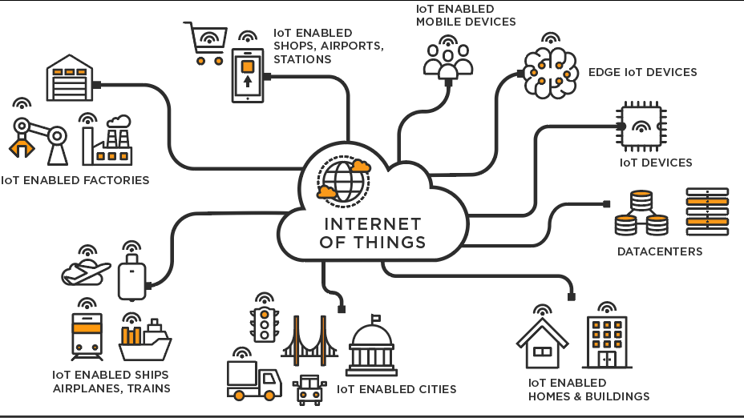

# IoT - Session 1

# Introduction to Internet of Things (IoT)

- In simple terms, it can be defined as “Constrained Computing devices equipped with sensors and displays (optional) interconnected to form a network for communication to target a specific use case”.
    - ********************************************************************Constrained Computing devices******************************************************************** → are computing devices but with very limited resources such as computation power (the clock rate), memory (RAM size).
    
    
    
    Courtesy: Analytics Vidhya
    

# IoT system description

- An IoT system consists of three major developmental parts namely,
    - ****************Software**************** - The high level software such as web applications. These devices are not as constrained in terms of resources as compared to IoT devices (constrained). The Technical term for these devices are microcontrollers.
    - **Firmware** - The software that is technically loaded on the Constrained computing devices (IoT nodes) for data acquisition and communication. The Technical term for these devices are microcontrollers.
    - **Hardware** - The physical hardware which contains the device (microcontroller and microprocessor), sensors and displays (optional).
- Microprocessors vs Microcontrollers - The constrained computing devices that were mentioned previously are collectively known as microcontrollers. Generally, Microprocessors are not highly constrained in terms of computing as compared to microcontrollers.

# What we will be doing in Zenith Sessions?

### Hardware

- Microcontrollers that support the Arduino IDE (such as Arduino Uno).
- Raspberry Pi 4 (is a **microprocessor**).
- ESP8266 (Wi-Fi enabled microcontroller) and ESP32 (Wi-Fi and Bluetooth enabled microcontroller).
- Different Sensors and displays

### Firmware

- Protocols to interface with sensors and displays.

### Software

- Back-end Server development using Python Flask.

### Other important topics

- Hardware design tips
- Schematic and *PCB Design (*- if time permits).
- A session on soldering!

# Prelude - Computing devices architectures

- Although this portion can be intimidating at first look, it will actually help you as time progresses and you will appreciate these facts once you understand them a year later.
- Note: This is not necessary to get started with IoT, but I personally thought of sharing this information across.
    
    
    | x86 | Arm | RISC-V |
    | --- | --- | --- |
    | Closed architecture.
    Not easy for beginners to start
    designing systems | Licensed hardware design (low level) Industry standard currently (one of highly demanded skill in the field of embedded systems) | Open hardware design, hence it is
    easy to start designing systems. |
    | Examples: Your Laptop (except for Apple silicon based) | Examples: Raspberry Pi, Smart
    Phones | (This architecture is just picking
    pace) Currently there are some
    offerings but they are yet to capture the market |
    | License cost is high | License cost is less comparatively | No license cost! |

# Raspberry Pi 4

- We will first look at the architecture of Raspberry Pi 4 to help ourselves understand what features it provides us to play around with.


Courtesy- raspberrypi.com

- USB ports for interfacing with devices such as mouse and keyboard.
- Gigabit Ethernet for networking and it also supports Power on Ethernet (PoE). Checkout [https://www.seeedstudio.com/blog/2019/12/11/what-is-poe-and-how-to-use-it-with-the-raspberry-pi/](https://www.seeedstudio.com/blog/2019/12/11/what-is-poe-and-how-to-use-it-with-the-raspberry-pi/) for more info on this.
- Has 2x micro HDMI for display.
- Comes in three different RAM configurations (1GB, 2GB, 4GB).
- It has an Arm processor which is capable of running OS. The standard OS that most start out with is the Raspberry Pi OS that is built over the Linux OS. Since Raspberry Pi is different from your laptop (such as exposed camera and display interfaces), the Raspberry Pi OS is built in such a way that it provides users with the functions (software) to access the hardware. For more info on the OS checkout [https://www.raspberrypi.com/software/](https://www.raspberrypi.com/software/)
- The OS is loaded by having the OS image in an SD card (inserted in SD card slot which is present in the backside of Raspberry Pi board).
- GPIO (this requires a different section)!
- We will be writing our programs in Python3.x to interface with the hardware.

# GPIO

- General Purpose Input Output
- These are pins on the board which can be used to set logic values (in output mode) or read logic values (in input mode).
- **Raspberry Pi uses a 3.3V logic standard!**
    
     ](./assets/Untitled%202.png)
    
    Courtesy: [https://www.raspberrypi.com/documentation/computers/raspberry-pi.html](https://www.raspberrypi.com/documentation/computers/raspberry-pi.html) 
    

# GPIO Programming Hands on

## LED Toggling - Software logic

- Lets first analyze this problem. We are given a LED and we have to blink it at a particular rate. Let’s take that the on and off time is 1 second.
    1. Pin configuration: Select a GPIO pin and set its mode (input or output). Here we need to output the logic levels to drive the LED, hence we define a pin in output mode. In this example we will be using the GPIO pin 40 (pin 40 is numbered with respect to the Circuit board of the Raspberry Pi, you can specify GPIO 21 in case if you’re talking with respect to the Broadcom processor, Check the code explanation below for more information).
    2. Set the logic levels using necessary functions with a delay in between to observe the blinking.

## Hardware design for LEDs (and the Circuit Diagram)

- This small hardware design tip can be applied to any microcontroller or microprocessor project.
- Don’t just directly connect the GPIO pin to the LED’s positive lead. It is highly advisable to use a resistor in series to limit the current flow. This resistor value can be calculated for our case as follows,
    
    
    
    - Since Raspberry Pi 4 uses 3.3V logic level, a logic high would mean that the GPIO port (here GPIO 40) will be set to 3.3Volts. A simple Red LED can technically turn on (the forward voltage) at 1.8 or 1.9V (Check the datasheet for these information) and the general current consumption for an LED is around 10mA. Directly connecting LED to the GPIO pin may allow for large amounts of current to flow through, which may reduce the life time of the LED. Hence we use a **********************************************current limiting resistor**********************************************.
    - The value of this current limit limiting resistor is found by,
        
        $$
        R = \frac{(V_{GPIO}-V_F)}{I_{LED}}
        $$
        
    - In our case, $V_{GPIO}$ is 3.3V and $V_F$ is 1.8V (the forward voltage for a red LED) and Current limit is 10mA in general for LEDs.
    - Plugging in the values, we get the current limiting resistor R as 150 Ohms.

## Implementation

1. Usually, the python library `RPi.GPIO` will be pre-installed with Raspberry Pi OS, but just in case if you get `Module Not found error` . You can install it by using the command,
    
    ```bash
    pip install RPi.GPIO
    ```
    
2. The below code is a script for toggling LED every 1 second:
    
    To start typing in code, you can use the `Geany` editor or use `nano` to write the script.
    
    - For `nano`, open up the terminal and type in `nano <file_name>.py` and then start typing in the script given below.
    
    ```python
    # import the necessary packages
    import RPi.GPIO as GPIO 
    from time import sleep
    
    # GPIO configurations
    GPIO.setmode(GPIO.BOARD) # This is used to inform the GPIO module that you will be 
    # using the pin mapping with respect to the board.
    GPIO.setup(40,GPIO.OUT,initial=0) # Here you're setting the GPIO pin number 40 to be
    # an output port with the initial value of Logic zero (or) 0V
    
    try: # Runs the try block until an exception like (Ctrl+C) to stop the code occurs.
    	while 1: # Always run this block of code until it is Keyboard interrupted (Ctrl+c)
    		GPIO.output(40,1) # We are setting the GPIO pin 40 to High
    		sleep(1) # 1 second of delay
    		GPIO.output(40,0) # We are setting the GPIO pin 40 to Low
    		sleep(0) # 1 second of delay
    except: # This segment of code runs on exit
    	GPIO.cleanup() # This is used to clear the hardware configuration (registers) that
    								 # was made during the GPIO configuration
    ```
    
    In order to execute this file, use
    
    ```bash
    python3 <file_name>.py
    ```
    
- You should see the LED in pin number 40 blinking (hopefully you didn’t burn anything :) Congrats if this your first time programming the Raspberry Pi!

## Code explanation

### `GPIO.setmode`

```python
GPIO.setmode(GPIO.BOARD) 
```

- This is used to inform the GPIO module that you will be using the pin mapping with respect to the board. You can specify `GPIO.BCM` to tell the script that you will be referring the GPIO pin with respect to the Broadcom chip.

### `GPIO.setup`

- This is used to setup the pin mode of a GPIO pin such as Input or Output. The initial value can also be provided while setting up an output GPIO pin. This can be done using, `GPIO.setup(GPIO.OUT,initial=0)` for setting the initial logic value to Low.

### `GPIO.output`

- This is used to set the logic values to the specified GPIO pin.
- `GPIO.output(40,1)` - can be used to set the logic High to the pin number 40.

### `GPIO.cleanup`

- This is a very important code snippet that must be used after the execution of our python code. This is used to clear the GPIO configuration that our program did to the Raspberry Pi hardware (such as setting up the output port, etc).
- This is widely used to prevent GPIO pin damages especially if the GPIO pin is configured as an output. Using this function can reset all the configurations for GPIO that particular program did and set those used pins to input mode (as input mode has higher impedance, it is immune to accidental shorts as compared to an output pin whose impedance is fairly very less).
- Do checkout [https://raspi.tv/2013/rpi-gpio-basics-3-how-to-exit-gpio-programs-cleanly-avoid-warnings-and-protect-your-pi](https://raspi.tv/2013/rpi-gpio-basics-3-how-to-exit-gpio-programs-cleanly-avoid-warnings-and-protect-your-pi) for more info!

## References

- A great place to get info and documentation of Raspberry Pi [https://www.raspberrypi.com/documentation/computers/getting-started.html](https://www.raspberrypi.com/documentation/computers/getting-started.html)
- Information on `gpio.cleanup` - [https://raspi.tv/2013/rpi-gpio-basics-3-how-to-exit-gpio-programs-cleanly-avoid-warnings-and-protect-your-pi](https://raspi.tv/2013/rpi-gpio-basics-3-how-to-exit-gpio-programs-cleanly-avoid-warnings-and-protect-your-pi)