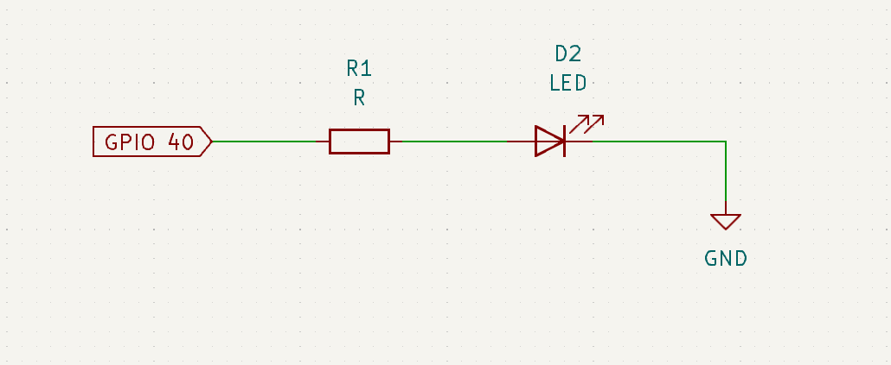

# IoT - Session 2

- Table of contents

# General Instructions

- To start typing in code, you can use the `Geany` editor or `Thony` editor or use `nano` to write the script in the terminal itself.
- `Thony` editor allows you to type as well as run the script in the IDE. In the other approach, you will have to use the terminal to run the `python3` script that you will be writing.
- Usually, the python library `RPi.GPIO` will be pre-installed with Raspberry Pi OS, but just in case if you get `Module Not found error` . You can install it by using the command, (Use admin privileges if required)
    
    ```bash
    pip install RPi.GPIO
    ```
    

### `nano` approach

- Open a terminal, and move into your project folder (directory) by using the `cd` command).
- Type in `nano <filename>.py` and start writing your scripts.
- Once you’re done typing the script, press `Ctrl+S` to save and `Ctrl+X` to exit.
- Now type, `python3 <filename>.py` to execute your python script.

# Syntax Explanation for RPi.GPIO module

### `GPIO.setmode`

```python
GPIO.setmode(GPIO.BOARD) 
```

- This is used to inform the GPIO module that you will be using the pin mapping with respect to the board. You can specify `GPIO.BCM` to tell the script that you will be referring the GPIO pin with respect to the Broadcom chip.

### `GPIO.setup`

- This is used to setup the pin mode of a GPIO pin such as Input or Output. The initial value can also be provided while setting up an output GPIO pin. This can be done using, `GPIO.setup(GPIO.OUT,initial=0)` for setting the initial logic value to Low.

### `GPIO.output`

- This is used to set the logic values to the specified GPIO pin.
- `GPIO.output(40,1)` - can be used to set the logic High to the pin number 40.

### `GPIO.cleanup`

- This is a very important code snippet that must be used after the execution of our python code. This is used to clear the GPIO configuration that our program did to the Raspberry Pi hardware (such as setting up the output port, etc).
- This is widely used to prevent GPIO pin damages especially if the GPIO pin is configured as an output. Using this function can reset all the configurations for GPIO that particular program did and set those used pins to input mode (as input mode has higher impedance, it is immune to accidental shorts as compared to an output pin whose impedance is fairly very less).
- Do checkout [https://raspi.tv/2013/rpi-gpio-basics-3-how-to-exit-gpio-programs-cleanly-avoid-warnings-and-protect-your-pi](https://raspi.tv/2013/rpi-gpio-basics-3-how-to-exit-gpio-programs-cleanly-avoid-warnings-and-protect-your-pi) for more info!

# LED Toggling - Software logic

- Lets first analyze this problem. We are given a LED and we have to blink it at a particular rate. Let’s take that the on and off time is 1 second.
    1. Pin configuration: Select a GPIO pin and set its mode (input or output). Here we need to output the logic levels to drive the LED, hence we define a pin in output mode. In this example we will be using the GPIO pin 40 (pin 40 is numbered with respect to the Circuit board of the Raspberry Pi, you can specify GPIO 21 in case if you’re talking with respect to the Broadcom processor, Check the code explanation below for more information).
    2. Set the logic levels using necessary functions with a delay in between to observe the blinking.

### Hardware design for LEDs (and the Circuit Diagram)

- This small hardware design tip can be applied to any microcontroller or microprocessor project.
- Don’t just directly connect the GPIO pin to the LED’s positive lead. It is highly advisable to use a resistor in series to limit the current flow. This resistor value can be calculated for our case as follows,
    
    
    
    - Since Raspberry Pi 4 uses 3.3V logic level, a logic high would mean that the GPIO port (here GPIO 40) will be set to 3.3Volts. A simple Red LED can technically turn on (the forward voltage) at 1.8 or 1.9V (Check the datasheet for these information) and the general current consumption for an LED is around 10mA. Directly connecting LED to the GPIO pin may allow for large amounts of current to flow through, which may reduce the life time of the LED. Hence we use a **********************************************current limiting resistor**********************************************.
    - The value of this current limit limiting resistor is found by,
        
        $$
        R = \frac{(V_{GPIO}-V_F)}{I_{LED}}
        $$
        
    - In our case, $V_{GPIO}$ is 3.3V and $V_F$ is 1.8V (the forward voltage for a red LED) and Current limit is 10mA in general for LEDs.
    - Plugging in the values, we get the current limiting resistor R as 150 Ohms.

### Code implementation

- The below code is a script for toggling LED every 1 second
- To start typing in code, you can use the `Geany` editor or use `nano` to write the script.
    - For `nano`, open up the terminal and type in `nano <file_name>.py` and then start typing in the script given below.
    
    ```python
    # import the necessary packages
    import RPi.GPIO as GPIO 
    from time import sleep
    
    # GPIO configurations
    GPIO.setmode(GPIO.BOARD) # This is used to inform the GPIO module that you will be 
    # using the pin mapping with respect to the board.
    GPIO.setup(40,GPIO.OUT,initial=0) # Here you're setting the GPIO pin number 40 to be
    # an output port with the initial value of Logic zero (or) 0V
    
    try: # Runs the try block until an exception like (Ctrl+C) to stop the code occurs.
    	while 1: # Always run this block of code until it is Keyboard interrupted (Ctrl+c)
    		GPIO.output(40,1) # We are setting the GPIO pin 40 to High
    		sleep(1) # 1 second of delay
    		GPIO.output(40,0) # We are setting the GPIO pin 40 to Low
    		sleep(0) # 1 second of delay
    except: # This segment of code runs on exit
    	GPIO.cleanup() # This is used to clear the hardware configuration (registers) that
    								 # was made during the GPIO configuration
    ```
    
- In order to execute this file, use
    
    ```bash
    python3 <file_name>.py
    ```
    
- You should see the LED in pin number 40 blinking (hopefully you didn’t burn anything :) Congrats if this your first time programming the Raspberry Pi!

# Interfacing Ultrasonic sensor

- You can read this website to get more insights to how this specific sensor works - [https://lastminuteengineers.com/arduino-sr04-ultrasonic-sensor-tutorial/](https://lastminuteengineers.com/arduino-sr04-ultrasonic-sensor-tutorial/).

### Hardware Design and Circuit Diagram

- In the website mentioned above, you would have seen as to how to interface this HCSR-04 Ultrasonic range finding sensor with an Arduino. But if you recollect properly, Arduino and this sensor works on a ****************5V logic**************** whereas our Raspberry Pi works on a **3.3V logic**.
- This means, when the trigger signal is sent by the Raspberry Pi to the sensor, the Echo pin stays high (5V) as along as there the reflection is not yet detected. **Connecting Echo pin directly to the Raspberry Pi’s input GPIO pin can result in hardware damages!**
- Feed the VCC of HCSR-04 with 5V from RPi and GND with GND. Take high caution that you don’t short these as the board will be damaged beyond repair.


- Hence we use a potential divider network to bring down the 5V to 3.3V so that our Raspberry Pi is safe and sound to read that 3.3V signal.
- The circuit connection diagram is shown below. Feel free to use other GPIO pins and not necessarily the ones shown here.

### Code implementation

- The below code defines the Trigger pin at GPIO 18 [Pin 12 on the board] (not the actual 18th pin, this GPIO18 is with reference to the Broadcom chip, hence we use `GPIO.BCM` in `setmode`).
- The Echo input pin is configured at GPIO 24 [Pin 18].
- The logic explained in the sensor working to calculate the distance is implemented in the function `distance()`.

```python
import RPi.GPIO as GPIO # Import Raspberry Pi GPIO library
import time # Import the time library for delays

# Set GPIO mode to BCM, which refers to the pin numbers on the Broadcom SOC channel
GPIO.setmode(GPIO.BCM)

# Define GPIO pins for the ultrasonic sensor
GPIO_TRIGGER = 18 # GPIO pin for the ultrasonic sensor's trigger
GPIO_ECHO = 24 # GPIO pin for the ultrasonic sensor's echo

# Set the GPIO direction (IN / OUT) for the trigger and echo
GPIO.setup(GPIO_TRIGGER, GPIO.OUT) # Trigger pin set as output
GPIO.setup(GPIO_ECHO, GPIO.IN) # Echo pin set as input

# Function to measure the distance
def distance():
    # Trigger the ultrasonic sensor by setting it to HIGH and then LOW after a brief period
    GPIO.output(GPIO_TRIGGER, True)
    time.sleep(0.00001) # Wait for 10 microseconds
    GPIO.output(GPIO_TRIGGER, False)
    StartTime = time.time() # Initialize StartTime
    StopTime = time.time() # Initialize StopTime
    
    # Save the StartTime when the Echo pin is LOW
    while GPIO.input(GPIO_ECHO) == 0:
        StartTime = time.time()
        
    # Save the StopTime when the Echo pin is HIGH (sound wave received back)
    while GPIO.input(GPIO_ECHO) == 1:
        StopTime = time.time()
    
    # Calculate time difference between start and arrival
    TimeElapsed = StopTime - StartTime
    # Calculate distance: multiply with the sonic speed (34300 cm/s)
    # and divide by 2 (for the round trip)
    distance = (TimeElapsed * 34300) / 2
    return distance
    
# Main script execution
if __name__ == '__main__':
    try:
        while True: # Infinite loop to continuously measure distance
            dist = distance() # Measure distance
            print("Measured Distance = %.1f cm" % dist) # Print the measured distance
            time.sleep(1) # Wait for 1 second before the next measurement
    
    # Stop the program and clean up GPIO settings when a keyboard interrupt (Ctrl+C) is received
    except KeyboardInterrupt:
        print("Measurement stopped by User")
        GPIO.cleanup() # Cleanup GPIO settings
```

# Interfacing a simple IR sensor

- The simple IR sensor has a source IR LED and a IR receiver LED. (The black hat LED is the Receiver IR LED).
- Since the voltage produced by the IR receiver LED is analog in nature, we often use an Op-amp as a comparator to threshold the signal into two logic levels. This threshold value can be adjusted by “calibrating” the potentiometer.
- There is no universal threshold value, and it purely depends on the operating environment, individual IR LED response, the Op-amp as well.


- Play around with the threshold value and you will get some idea.

### Circuit diagram

- Use a GPIO pin for reading the V_out (can be any name, check the PCB text [technically called PCB footprint] for more info).


### Code implementation

- This is left up to you to implement. Try to write the script for interfacing this sensor, and probably light up an LED or print a message when the sensor output logic state changes.

# Interfacing PIR Motion Sensor

- Read this tutorial to understand how the sensor works, and how you can interface with it. [https://lastminuteengineers.com/pir-sensor-arduino-tutorial/](https://lastminuteengineers.com/pir-sensor-arduino-tutorial/)
- The PIR sensor has an internal 3.3V regulator, so you can power the sensor using a 5V pin from Raspberry Pi.
- The Output pin from the sensor follows the 3.3V logic. Hence we won’t be requiring a potential divider network for the PIR sensor.


### Circuit diagram

- The below image shows the circuit diagram to interface the PIR sensor with a Raspberry Pi. Feel free to use any GPIO pin as you will only be using one input pin to read the status of the Sensor.


- In the code implementation, we have used physical pin 11 (not GPIO 11) as the input pin to read the status of the sensor.

### Code implementation

```python
import RPi.GPIO as GPIO # Import Raspberry Pi GPIO library
import time # Import the time library for delays

GPIO.setwarnings(False) # Disable GPIO warnings (useful if GPIO pins have been configured previously)
GPIO.setmode(GPIO.BOARD) # Use physical pin numbering for GPIO

# Setup GPIO pin 11 as an input pin, connected to the PIR sensor
GPIO.setup(11, GPIO.IN)

# Setup GPIO pin 3 as an output pin, connected to the LED
GPIO.setup(3, GPIO.OUT)

try:
    while True: # Create an infinite loop to continuously check PIR sensor
        i = GPIO.input(11) # Read the value from the PIR sensor
        if i == 0: # When output from motion sensor is LOW (no motion detected)
            print("No intruders", i)
            GPIO.output(3, 0) # Turn OFF LED
            time.sleep(0.1) # Short delay of 0.1 seconds
        else: # When output from motion sensor is HIGH (motion detected)
            print("Intruder detected", i)
            GPIO.output(3, 1) # Turn ON LED
            time.sleep(0.1) # Short delay of 0.1 seconds
except:
    GPIO.cleanup()
```

# Interfacing the Camera

- To interface the camera, we use the onboard MIPI/CSI connector. This is the most standard protocol that cameras use to transfer data.
- In this session, we will be exploring on using the camera using the APIs provided by Raspberry Pi. You can technically use the Python equivalent, but I’ll leave that as a self-exploration for you. Check the appendix part (below this) for more info.
- The APIs provided by Raspberry Pi work out of the box and require no installation. These APIs can be run using terminal commands such as `libcamera-still` to capture a still image.
- `libcamera` provides various image and video capturing APIs.


Image courtesy: dronebotworkshop.com

- Connect the camera properly, follow this animation at [https://projects.raspberrypi.org/en/projects/getting-started-with-picamera/2](https://projects.raspberrypi.org/en/projects/getting-started-with-picamera/2) (You can technically follow their steps mentioned, but it’s outdated and doesn’t use `libcamera`).
- To preview the camera feed, you can open the terminal and run the following command. 
The `-t 5000` here tells the `libcamera-still` to show us the camera preview for 5 seconds (or 5000ms).
    
    ```bash
    libcamera-hello -t 5000
    ```
    
- You can use `-t 0` to view the preview indefinitely!
- To store or capture the image, you can use the following command.
    
    ```bash
    libcamera-jpeg -o test.jpg
    ```
    
    This would still show a 5 second preview of the camera feed before storing the image in test.jpg
    
- To just capture the image without any preview, you can use
    
    ```bash
    libcamera-jpeg -n -o test.jpg
    ```
    
    The `-n` flag (no preview) is used.
    
- To find out more functions available, run `libcamera-jpeg --help`.

### Appendix - Using PiCamera2 and Enabling Camera

- You can use PiCamera2 if you are using Python to access camera, you might have to run on the camera option in `raspi-config` or you can do so as shown below.

- Go to the main menu and open the **Raspberry Pi Configuration** tool.
- The configuration window would pop up, click enabled for the camera and you can continue. (You might have to restart the board if you still can’t access the camera).
- Reference: [https://projects.raspberrypi.org/en/projects/getting-started-with-picamera/2](https://projects.raspberrypi.org/en/projects/getting-started-with-picamera/2) (reminder that this is a quite out dated blog but it has nice animations and steps).


# References

1. A great place to get info and documentation of Raspberry Pi
[https://www.raspberrypi.com/documentation/computers/getting-started.html](https://www.raspberrypi.com/documentation/computers/getting-started.html)
2. Information on `gpio.cleanup` 
[https://raspi.tv/2013/rpi-gpio-basics-3-how-to-exit-gpio-programs-cleanly-avoid-warnings-and-protect-your-pi](https://raspi.tv/2013/rpi-gpio-basics-3-how-to-exit-gpio-programs-cleanly-avoid-warnings-and-protect-your-pi) 
3. HCSR-04 Ultrasonic sensor working and interfacing with Arduino
[https://lastminuteengineers.com/arduino-sr04-ultrasonic-sensor-tutorial/](https://lastminuteengineers.com/arduino-sr04-ultrasonic-sensor-tutorial/) 
4. PIR Motion sensor working and interfacing with Arduino
[https://lastminuteengineers.com/pir-sensor-arduino-tutorial/](https://lastminuteengineers.com/pir-sensor-arduino-tutorial/)
5. Raspberry Pi Documentation for using the camera
[https://www.raspberrypi.com/documentation/computers/camera_software.html](https://www.raspberrypi.com/documentation/computers/camera_software.html) (make sure you use `libcamera` instead of the `raspistill` or `rpicam`.
6. An article to learn more on `libcamera`
[https://dronebotworkshop.com/pi-autofocus/](https://dronebotworkshop.com/pi-autofocus/) 
7. PiCamera2 documentation
[https://datasheets.raspberrypi.com/camera/picamera2-manual.pdf](https://datasheets.raspberrypi.com/camera/picamera2-manual.pdf)
8. `libcamera-jpeg —help` functions
[https://blog.devmobile.co.nz/2022/01/24/libcamera-jpeg-on-raspberry-pi-os-bullseye-duration/](https://blog.devmobile.co.nz/2022/01/24/libcamera-jpeg-on-raspberry-pi-os-bullseye-duration/)