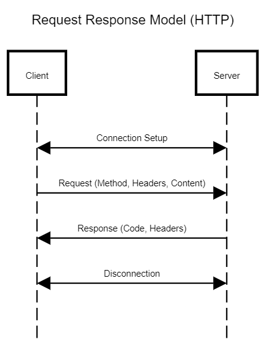
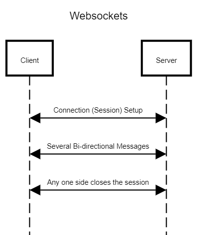

# IoT - Session 3

# Introduction to Python Flask

- Introduction to Python Flask was presented by Nadhim T from the Web Dev domain.
- Refer to the recorded video for notes as they won’t be documented here.
- More resources on Flask are mentioned in [1] reference.

<aside>
➡️ The session recording is available at `[Will be updated soon!]`

</aside>

## IoT based applications of Flask

- Bolt IoT uses Flask for their backend.
- Blynk uses a Java based server for their backend.

### Raspberry Pi as the Server (ideas)

- Home automation with Raspberry PI as the server to which all requests from devices would be made.
- In the following sessions we will control the GPIO pins using Flask server

### Raspberry Pi (”is a microprocessor”) and other microcontroller as the Client

- You could have an old laptop as the Home media server to which you can use a Raspberry Pi to stream its camera feed (similar to a video surveillance system). Refer [2] for using your old laptop as a Home media server.

### ESP 8266 or ESP 32 (The Wi-Fi enabled microcontroller) as Server

- You can have an RGB LED controlled by a web application (which is hosted on the microcontroller). Check [3] reference for the implementations.

### Other examples (not necessarily using Flask)

- Electric Scooter dashboards use Bluetooth (but the model for data communication is technically the same). Only the Physical layer or the mode of communication is different.

# Intro to HTTP vs Websockets (Which one to use where?)

### Request Response Model

- Based on the Request Response model
    
    
    

### Websockets

- Duplex (infers Bi-directional) communication model.
    
    
    

## Doubts asked during the session:

1. **For queries related to Flask usage and module installation**, refer to the video and also the Flask installation section in this page. If you still face some new problem, feel free to send us a message in the IoT WhatsApp group.
2. **How is MQTT and Web sockets different in the context of bi-directional communication. Isn’t MQTT bi-directional as well, if so why do we need web-sockets?**
    
    Let’s first analyze the architecture of MQTT and WebSockets.
    
    - In Websocket based implementation, we have two nodes that have a sustained TCP connection over the network for data transfer. In this model, the data channel is duplexed meaning both the nodes can send and receive packets simultaneously.
    - In MQTT, we have a Client (Publisher and Subscriber collectively) and a Broker. The communication model between the publisher-broker and broker-subscriber is implemented through a TCP connection (each connection between the nodes is implemented so). MQTT is a bi-directional communication model which infers that both the nodes in the connection (a client and the broker here) can send messages (**but not simultaneously**).
    
    The difference between bi-directional and duplex communication model:
    
    - Bi-directional model says that both the nodes can send packets to each other.
    - Duplex means that both the nodes can “**simultaneously**” transmit and receive packets.
    
    **A duplex connection (having upstream and downstream communication channels) would be bi-directional, but a bi-directional connection need not be duplex.**
    
    MQTT is primarily optimized for one to many communication (one publisher to multiple subscribers). As far as my findings go, MQTT doesn’t implement a duplex channel for communication as it was primarily developed to send low data packets in limited bandwidth networks.
    
    Websockets on the other hand were built for streaming high (relative to what MQTT can support) amounts of data packets to-and-fro both the nodes that are connected. This model was not specifically intended to be used on resource-constrained devices such as microcontrollers. You can implement Websockets on an ESP8266 or ESP32 but it should be a reminder that they are more powerful in terms of performance [32 bit microcontroller] and clock frequency [runs 100+MHz] compared to the 8-bit 16MHz clocked Atmega328p (the microcontroller on the Arduino Uno). This is primarily the reason why such resource-constraint devices such as Arduino Uno can implement MQTT with an ethernet adapter. (Refer [6] for more information)
    
    What majorly distinguishes MQTT and Web sockets in the context of communication link is that Web Sockets have a dedicated duplex channel for two way communication and data transfer can happen simultaneously. MQTT doesn’t have a duplex channel but supports bi-directional communication (A Subscriber can send subscribe packet or receive configuration packet from broker. The Publisher can send Publish messages to broker and it can also receive configuration messages from the broker.)
    

### References

1. For more into the web dev part of Flask
    - [https://www.youtube.com/playlist?list=PL-osiE80TeTs4UjLw5MM6OjgkjFeUxCYH](https://www.youtube.com/playlist?list=PL-osiE80TeTs4UjLw5MM6OjgkjFeUxCYH)
    - [https://www.youtube.com/playlist?list=PLzMcBGfZo4-n4vJJybUVV3Un_NFS5EOgX](https://www.youtube.com/playlist?list=PLzMcBGfZo4-n4vJJybUVV3Un_NFS5EOgX)
2. Using your old laptop as a media server [https://www.youtube.com/watch?v=lXcfKTNObOo](https://www.youtube.com/watch?v=lXcfKTNObOo) 
3. Making a RGB LED controller using an ESP8266
    - A Bow-Tie with RGB LEDs controlled using a Webserver [https://www.youtube.com/watch?v=q1nSY2faLgM](https://youtu.be/q1nSY2faLgM)
    - Natively with the webserver library [https://www.youtube.com/watch?v=abL9dq_Pzm4](https://www.youtube.com/watch?v=abL9dq_Pzm4)
    - Using the Blynk App [https://youtu.be/DkJ1f5UIuak](https://youtu.be/DkJ1f5UIuak?si=t_D-Xv-7zHwYkMkn)
4. Websockets Vs HTTP [https://www.geeksforgeeks.org/what-is-web-socket-and-how-it-is-different-from-the-http/](https://www.geeksforgeeks.org/what-is-web-socket-and-how-it-is-different-from-the-http/) 
5. MQTT [https://en.wikipedia.org/wiki/MQTT](https://en.wikipedia.org/wiki/MQTT)
6. Implementing MQTT with an Arduino Uno as Client [https://resources.altium.com/p/getting-started-mqtt](https://resources.altium.com/p/getting-started-mqtt)